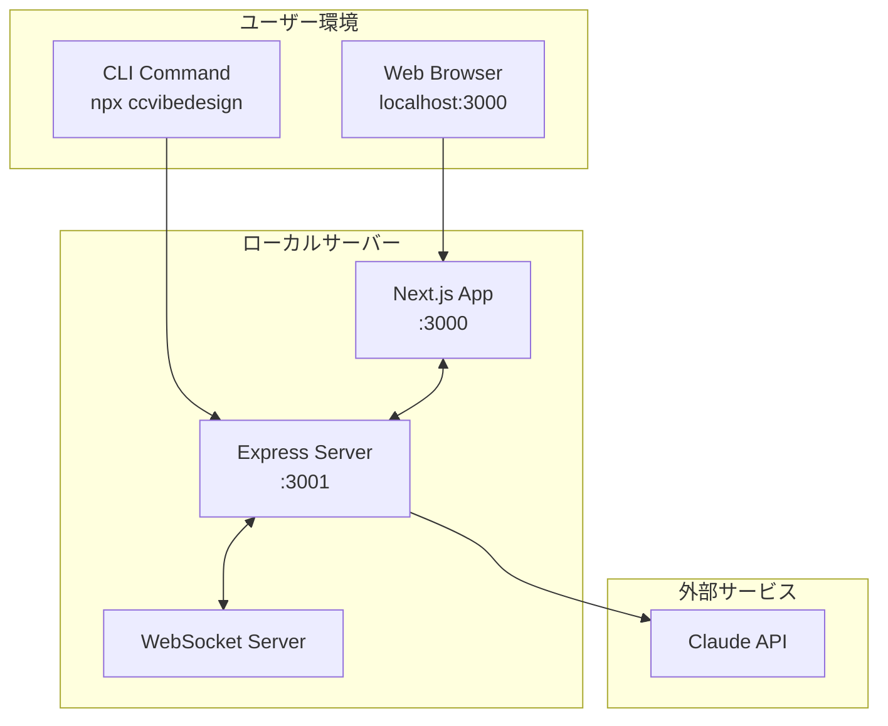
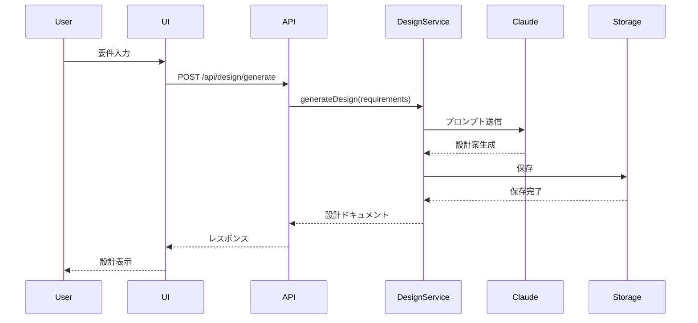
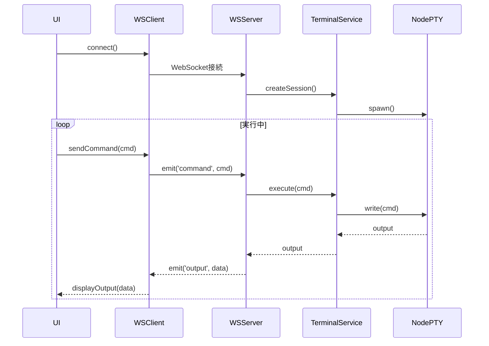

# アーキテクチャ設計書

## 1. システム概要

### 1.1 アーキテクチャパターン
- **全体構造**: モノリシック + マイクロフロントエンド的アプローチ
- **通信方式**: REST API + WebSocket
- **データフロー**: 単方向データフロー（Flux-like）
- **レイヤー構造**: 3層アーキテクチャ（Presentation, Business Logic, Data）

### 1.2 デプロイメント構成


## 2. レイヤーアーキテクチャ

### 2.1 プレゼンテーション層
```
/packages/web/
├── app/                    # Next.js App Router
│   ├── layout.tsx          # ルートレイアウト
│   ├── page.tsx            # ホームページ
│   ├── dashboard/          # ダッシュボード
│   ├── editor/             # エディター画面
│   └── api/                # API Routes
├── components/             # UIコンポーネント
│   ├── ui/                 # shadcn/ui components
│   ├── features/           # 機能別コンポーネント
│   └── layouts/            # レイアウトコンポーネント
├── hooks/                  # カスタムフック
├── stores/                 # Zustand stores
└── lib/                    # ユーティリティ
```

### 2.2 ビジネスロジック層
```
/packages/core/
├── services/               # ビジネスロジック
│   ├── design/             # 設計生成サービス
│   ├── codegen/            # コード生成サービス
│   ├── validation/         # 検証サービス
│   └── ai/                 # AI統合サービス
├── models/                 # ドメインモデル
├── repositories/           # データアクセス抽象化
└── utils/                  # 共通ユーティリティ
```

### 2.3 データ層
```
/packages/data/
├── storage/                # ローカルストレージ
│   ├── projects/           # プロジェクトデータ
│   ├── templates/          # テンプレート
│   └── cache/              # キャッシュ
├── schemas/                # データスキーマ
└── migrations/             # データマイグレーション
```

## 3. コンポーネント設計

### 3.1 CLIコンポーネント
```typescript
interface CLIComponent {
  // エントリーポイント
  main(): Promise<void>;
  
  // コマンド処理
  commands: {
    init: InitCommand;
    start: StartCommand;
    generate: GenerateCommand;
    validate: ValidateCommand;
  };
  
  // 設定管理
  config: ConfigManager;
  
  // サーバー管理
  server: ServerManager;
}
```

### 3.2 サーバーコンポーネント
```typescript
interface ServerComponent {
  // Express アプリケーション
  app: Express.Application;
  
  // ルーター
  routers: {
    api: APIRouter;
    ws: WebSocketRouter;
  };
  
  // ミドルウェア
  middleware: {
    auth: AuthMiddleware;
    cors: CORSMiddleware;
    logging: LoggingMiddleware;
  };
  
  // サービス
  services: {
    design: DesignService;
    codegen: CodeGenService;
    terminal: TerminalService;
  };
}
```

### 3.3 フロントエンドコンポーネント
```typescript
interface FrontendComponent {
  // ページコンポーネント
  pages: {
    Dashboard: React.FC;
    Editor: React.FC;
    Settings: React.FC;
  };
  
  // 状態管理
  stores: {
    projectStore: ProjectStore;
    designStore: DesignStore;
    uiStore: UIStore;
  };
  
  // API クライアント
  apiClient: APIClient;
  
  // WebSocket クライアント
  wsClient: WebSocketClient;
}
```

## 4. データフロー設計

### 4.1 設計ドキュメント生成フロー


### 4.2 リアルタイム通信フロー


## 5. ディレクトリ構造

```
ccvibedesign/
├── packages/
│   ├── cli/                # CLIパッケージ
│   │   ├── src/
│   │   ├── package.json
│   │   └── tsconfig.json
│   ├── core/               # コアロジック
│   │   ├── src/
│   │   ├── package.json
│   │   └── tsconfig.json
│   ├── server/             # サーバー
│   │   ├── src/
│   │   ├── package.json
│   │   └── tsconfig.json
│   ├── web/                # Webフロントエンド
│   │   ├── app/
│   │   ├── components/
│   │   ├── package.json
│   │   └── tsconfig.json
│   └── shared/             # 共有型定義
│       ├── src/
│       ├── package.json
│       └── tsconfig.json
├── docs/                   # ドキュメント
│   ├── requirements/
│   ├── architecture/
│   └── planning/
├── templates/              # テンプレート
├── examples/               # サンプルプロジェクト
├── scripts/                # ビルドスクリプト
├── .github/                # GitHub Actions
├── package.json            # ルートpackage.json
├── pnpm-workspace.yaml     # pnpmワークスペース設定
├── tsconfig.json           # ルートTypeScript設定
└── README.md
```

## 6. API設計

### 6.1 REST API エンドポイント

#### 設計関連
- `POST /api/design/generate` - 設計生成
- `GET /api/design/:id` - 設計取得
- `PUT /api/design/:id` - 設計更新
- `DELETE /api/design/:id` - 設計削除
- `POST /api/design/validate` - 設計検証

#### コード生成関連
- `POST /api/codegen/generate` - コード生成
- `POST /api/codegen/preview` - コードプレビュー
- `GET /api/codegen/templates` - テンプレート一覧

#### プロジェクト関連
- `POST /api/projects` - プロジェクト作成
- `GET /api/projects` - プロジェクト一覧
- `GET /api/projects/:id` - プロジェクト詳細
- `PUT /api/projects/:id` - プロジェクト更新

### 6.2 WebSocket イベント

#### クライアント → サーバー
- `terminal:create` - ターミナルセッション作成
- `terminal:input` - コマンド入力
- `terminal:resize` - ターミナルリサイズ
- `design:update` - 設計リアルタイム更新

#### サーバー → クライアント
- `terminal:output` - ターミナル出力
- `design:changed` - 設計変更通知
- `progress:update` - 進捗更新
- `error:occurred` - エラー通知

## 7. セキュリティ設計

### 7.1 認証・認可
- ローカル環境のみで動作（認証不要）
- トークンベースのセッション管理（オプション）

### 7.2 入力検証
- すべての入力に対するバリデーション
- SQLインジェクション対策（該当なし）
- XSS対策（React自動エスケープ）

### 7.3 データ保護
- ローカルストレージの暗号化（オプション）
- APIキーの環境変数管理
- センシティブ情報のマスキング

## 8. パフォーマンス設計

### 8.1 最適化戦略
- **コード分割**: Next.jsの自動コード分割
- **遅延読み込み**: 動的インポートの活用
- **キャッシング**: 生成結果のキャッシュ
- **バッチ処理**: 複数リクエストの集約

### 8.2 目標メトリクス
- 初回起動: 3秒以内
- API応答: 200ms以内（AI生成除く）
- UI更新: 16ms以内（60fps）
- メモリ使用量: 500MB以下

## 9. エラーハンドリング

### 9.1 エラー分類
```typescript
enum ErrorType {
  VALIDATION_ERROR = 'VALIDATION_ERROR',
  GENERATION_ERROR = 'GENERATION_ERROR',
  API_ERROR = 'API_ERROR',
  STORAGE_ERROR = 'STORAGE_ERROR',
  NETWORK_ERROR = 'NETWORK_ERROR'
}

interface AppError {
  type: ErrorType;
  message: string;
  code: string;
  details?: any;
  stack?: string;
}
```

### 9.2 エラー処理フロー
1. エラー検出
2. ログ記録
3. ユーザー通知
4. リカバリー処理
5. レポート送信（オプション）

## 10. 拡張性設計

### 10.1 プラグインシステム
```typescript
interface Plugin {
  name: string;
  version: string;
  
  // ライフサイクルフック
  onInit?: () => Promise<void>;
  onDestroy?: () => Promise<void>;
  
  // 拡張ポイント
  extendAPI?: (router: Router) => void;
  extendUI?: (app: Application) => void;
  extendCLI?: (program: Command) => void;
  
  // カスタムサービス
  services?: Record<string, Service>;
  
  // テンプレート
  templates?: Template[];
}
```

### 10.2 テンプレートシステム
```typescript
interface Template {
  id: string;
  name: string;
  description: string;
  category: TemplateCategory;
  
  // テンプレート定義
  definition: {
    variables: Variable[];
    files: FileTemplate[];
    scripts: ScriptTemplate[];
  };
  
  // 生成ロジック
  generate: (context: GenerationContext) => Promise<GeneratedCode>;
}
```

## 11. 監視・ロギング

### 11.1 ログレベル
- `ERROR`: エラー情報
- `WARN`: 警告情報
- `INFO`: 一般情報
- `DEBUG`: デバッグ情報
- `TRACE`: 詳細トレース

### 11.2 メトリクス収集
- 生成回数
- 応答時間
- エラー率
- リソース使用量
- ユーザーアクション

## 12. 開発環境設定

### 12.1 必要ツール
- Node.js 18+
- pnpm 8+
- Git
- VS Code（推奨）

### 12.2 開発コマンド
```bash
# 依存関係インストール
pnpm install

# 開発サーバー起動
pnpm dev

# ビルド
pnpm build

# テスト実行
pnpm test

# リント実行
pnpm lint

# フォーマット
pnpm format
```